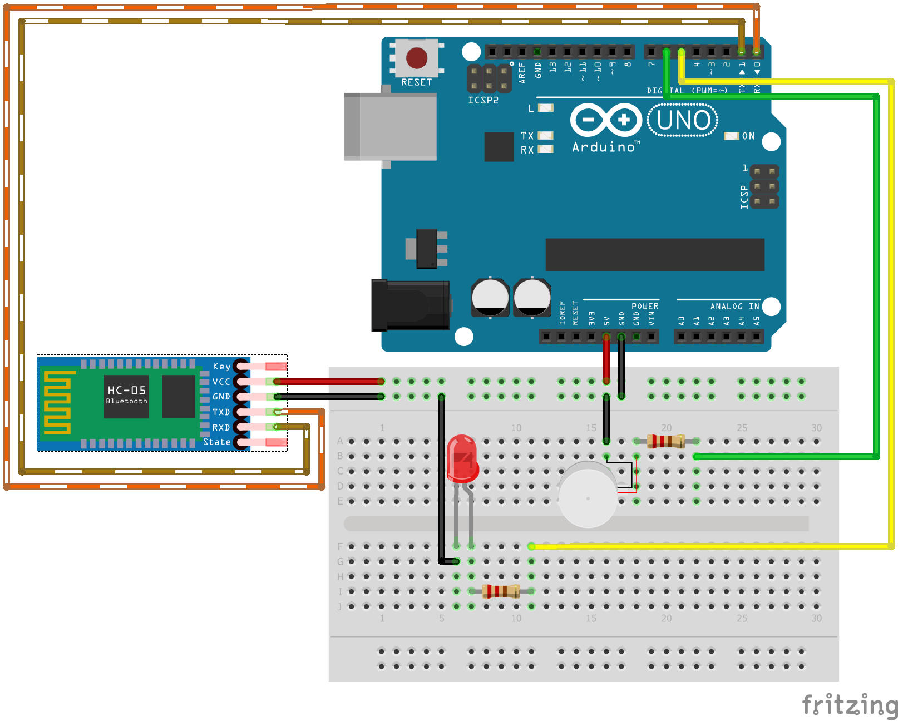

## Voice-controlled Arduino I/O over Bluetooth Serial

#### Introduction
This is an simple experiment to control output devices wirelessly using a phone through voice. It works through a general bluetooth serial interface. Ideally, this experiment should work over any bluetooth module that supports serial and micro-controller that supports software-serial, however this guide shall be focused for the parts listed below.

#### Components Required
1. Arduino Uno
2. HC05 Bluetooth Module
3. LEDs
4. Compatible Resistors
5. Stepper Motor / PWM-supported LED

#### Connection Guide

##### I/O Connection Map
| IO Device        | Pin Number           |
| ------------- |:-------------:| 
| LED     | 5 |
| Motor/PWM-supported LED     | 6      |
| HC-05| TXD - 0; RXD - 1|
| (Optional; not included in schematic diagram) LED| 13     |

##### Power Requirements
| IO Device        | Supported Voltages          |
| ------------- |:-------------:| 
| HC-05     | 3.6V / 5V |
| LED	| 3.3V+|

##### Schematic


#### Arduino Code
```
//Adapted from https://electronicshobbyists.com/arduino-pwm-tutorial/
#include <SoftwareSerial.h>

String value;
int TxD = 1;
int RxD = 0;
int servoposition;
SoftwareSerial bluetooth(RxD, TxD);
void setup() {
        pinMode(13, OUTPUT);
        pinMode(5, OUTPUT);
        pinMode(6, OUTPUT);
        Serial.begin(9600); // start serial communication at 9600bps
        bluetooth.begin(9600);
}
void loop() {
        Serial.println(value);
        if (bluetooth.available()) {
                value = bluetooth.readString();
                value.trim();
                if (value == "all LED turn on") {
                        digitalWrite(13, HIGH);
                        digitalWrite(5, HIGH);
                }
                if (value == "no speed") {
                        analogWrite(6, 0);
                }

                if (value == "speed 1") {
                        analogWrite(6, 75);
                }

                if (value == "Speed 2") {
                        analogWrite(6, 150);
                }

                if (value == "Speed 3") {
                        analogWrite(6, 255);
                }
                if (value == "all LED turn off") {
                        digitalWrite(13, LOW);
                        digitalWrite(5, LOW);
                }
                if (value == "turn on yellow LED") {
                        digitalWrite(13, HIGH);
                }
                if (value == "turn on Red LED") {
                        digitalWrite(5, HIGH);
                }
                if (value == "turn off yellow LED") {
                        digitalWrite(13, LOW);
                }
                if (value == "turn off red LED") {
                        digitalWrite(5, LOW);
                }
        }
        delay(500);
}

```

#### Voice over Bluetooth on phone

To simplify actions, please download the [Arduino Bluetooth Voice Controller](https://play.google.com/store/apps/details?id=appinventor.ai_nitinpandit_00.Arduino_bluetooth_voice_controller&hl=en_IN) app from the play store. Once connected to the HC-05 module, the app just transmits all the text over serial with which the arduino can process information.

